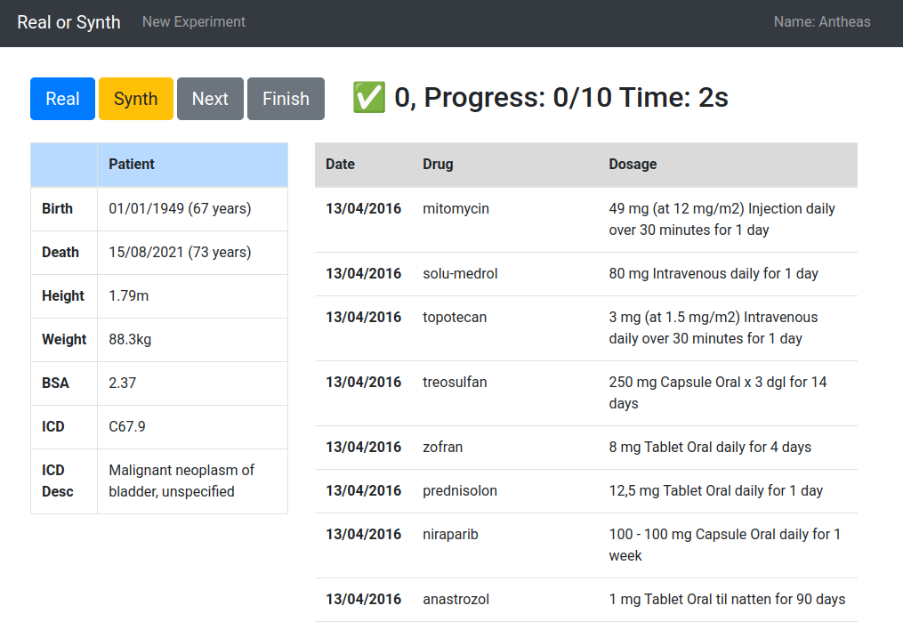

# SAME: Human-in-the-Loop Assessment of Synthetic Data Quality

SAME allows human experts to assess the fidelity of synthetic data by comparing it to real data. Then, the annotation data can be exported as a JSON and processed using e.g., a Jupyter notebook.

## Preview

## Installation
Coming soon.